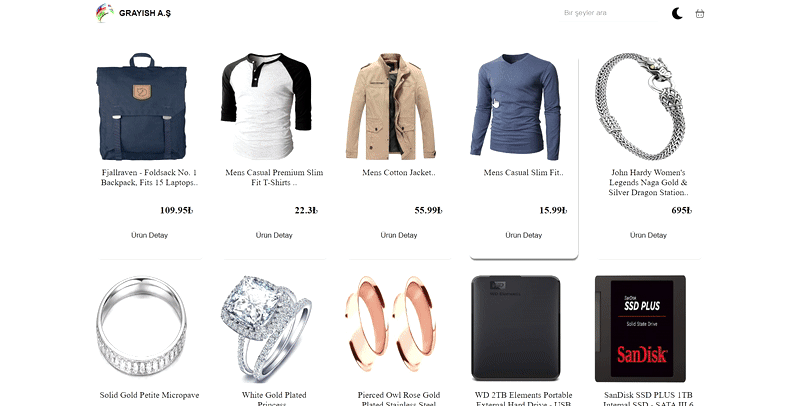

# E-Ticaret Uygulaması (React.js)

Bu proje, geliştirilen bir e-ticaret uygulamasıdır. Uygulama, ürün listeleme, arama, sepet yönetimi ve tema değiştirme gibi temel e-ticaret özelliklerini içermektedir.

## 🚀 Özellikler
- 🛒 **Ürün Listeleme:** API'den gelen ürünlerin listelenmesi
- 🔍 **Arama:** Ürünler arasında arama yapma
- ➕ **Sepet Yönetimi:** Ürün ekleme, çıkarma ve miktar azaltma
- 🌗 **Tema Değiştirme:** Koyu ve açık tema desteği
- ⚡ **Redux Toolkit Kullanımı:** Global state yönetimi

## 🛠️ Kullanılan Teknolojiler
- **React.js** (Vite ile)
- **Redux Toolkit** (Global state yönetimi için)
- **Axios** (API istekleri için)
- **Material UI** (Badge bileşeni için)
- **React Icons** (İkonlar için)

## 📝 API Kullanımı
Bu projede `https://fakestoreapi.com` kullanılmıştır. Ürünleri çekmek için şu endpoint kullanılmaktadır:
```sh
GET https://fakestoreapi.com/products
```



## 📦 Kurulum ve Çalıştırma
1. Projeyi klonlayın:
   ```sh
   git clone https://github.com/kullanici-adin/proje-adi.git
   cd proje-adi
   ```
2. Bağımlılıkları yükleyin:
   ```sh
   npm install
   ```
3. Uygulamayı başlatın:
   ```sh
   npm run dev
   ```
4. Tarayıcınızda açın: `http://localhost:5173`
